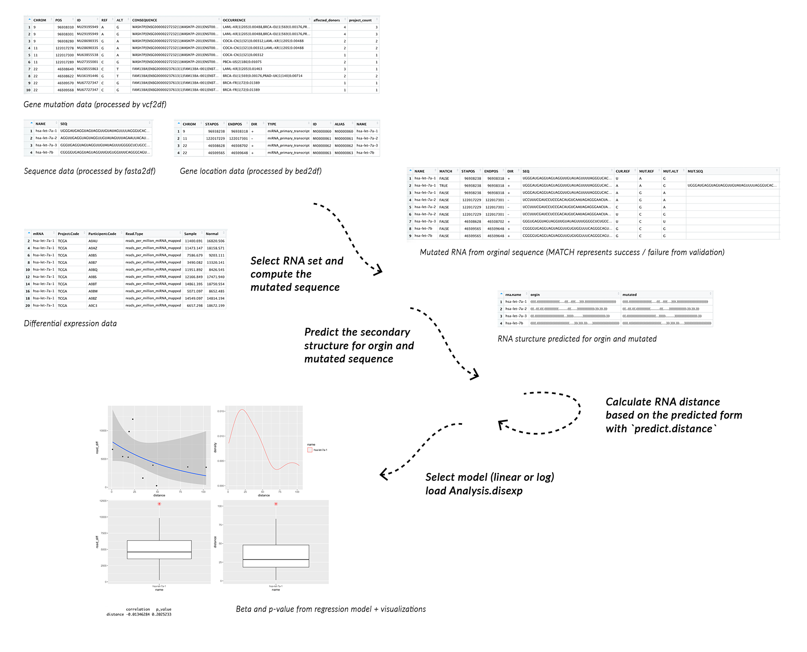

<!-- README.md is generated from README.Rmd. Please edit that file -->

```{r, include = FALSE}
knitr::opts_chunk$set(
  collapse = TRUE,
  comment = "#>",
  fig.path = "man/figures/README-",
  out.width = "100%"
)
```

# rseAnalysis

<!-- badges: start -->
<!-- badges: end -->

## Description

`rseAnalysis` (RNA structure and Expression analysis) package includes series of utility function including stander file reader, structural prediction, RNA distance calculation, and analysis package. `rseAnalysis` provides an all-in-one solution for gene expression and secondary structure mutation correlation analysis by automating the data processing and analysis of gene expression and mutation data from the well-knowleged database such as mirBase and TCGA. 

## Installation

You can install the development version from [GitHub](https://github.com/) with:

``` r
# install.packages("devtools")
devtools::install_github("JackXu2333/rseAnalysis")
```

## Overview

To list all functions available in the package: 

``` r
ls("package:rseAnalysis")
```

`rseAnalysis` consisted of 8 public functions. Functions __*vcf2df*__., __*fasta2df*__., __*bed2df*__. loads gene mutation, gene sequence and location data from vcf, fasta and bed file respectively; Functions __*predict.Structure*__. utilize command-line software *RNAstructure* to predict RNA secondary structure in dot-bracket form; Functions __*predict.distance*__. utilize command-line software *RNAdistance* to calculate gene distance based on structure; Working with gene mutation data, function __*RNA.validate*__. applies mutation to RNA sequence after validation on the genome assembly between files, __*DNA2RNA*__. maps DNA sequence to RNA after validation. Function __*Analysis.DISEXP*__. use regression to analyze genetic distance and gene expression data, offering the use of linear or logistic models.

An overview of the package is illustrated below:

 

Arrow illustration used in image: <a href='https://www.freepik.com/vectors/arrow'>Arrow vector created by starline - www.freepik.com</a>

## Tutorials  
  
For tutorials and plot interpretation, refer to the vignette:

``` r
browseVignettes("rseAnalysis")
```

## Contribution

rseAnalysis is initialized, developed and maintained by Sijie Xu <sijie.xu@mail.utoronto.ca>. Functions __*vcf2df*__., __*fasta2df*__., __*bed2df*__. uses import mechanism from package *vcfR* and *Biostrings* and tailor to the desired object form. Functions __*predict.Structure*__. and __*predict.distance*__. uses *RNA structure* and *RNAdistance* from users operating machine to generate results. __*DNA2RNA*__. use the s2c from *seqinr* R package, function __*Analysis.DISEXP*__. make use of glm and lm modelling provided by R *stats* package, as well as ggplot from *ggplot2* package to visualize the result. Last but not less, the key algorithm from function __*RNA.validate*__. is inspired by a project partnered with Zhiwen Tan, mainly contributed by Sijie Xu in 2020, referenced below. 

A file including human miRNA sequence, BRCA gene expression data used in both example and the test is sourced from miRBase and TCGA. 

## References

Baptiste Auguie (2017). gridExtra: Miscellaneous Functions for "Grid" Graphics. R package version 2.3.
https://CRAN.R-project.org/package=gridExtra
  
Charif D, Lobry J (2007). “SeqinR 1.0-2: a contributed package to the R project for statistical
computing devoted to biological sequences retrieval and analysis.” In Bastolla U, Porto M, Roman H,
Vendruscolo M (eds.), Structural approaches to sequence evolution: Molecules, networks, populations,
series Biological and Medical Physics, Biomedical Engineering, 207-232.
Springer Verlag, New York. ISBN : 978-3-540-35305-8. http://seqinr.r-forge.r-project.org/

H. Wickham. ggplot2: Elegant Graphics for Data Analysis. Springer-Verlag New York, 2016.

Hadley Wickham (2020). tidyr: Tidy Messy Data. R package version 1.1.2. https://CRAN.R-project.org/package=tidyr

Kozomara, A., & Griffiths-Jones, S. (2011). miRBase: integrating microRNA annotation and deep-sequencing data. Nucleic acids research, 39(Database issue), D152–D157. https://doi.org/10.1093/nar/gkq1027

Knaus BJ, Grünwald NJ (2016). “VcfR: an R package to manipulate and visualize VCF format data.” _BioRxiv_. <URL:
http://dx.doi.org/10.1101/041277>.

Pagès H, Aboyoun P, Gentleman R, DebRoy S (2020). Biostrings: Efficient manipulation of biological strings.
R package version 2.58.0, https://bioconductor.org/packages/Biostrings 
  
Wickham, H. and Bryan, J. (2019). *R Packages* (2nd edition). Newton, Massachusetts: O'Reilly Media. https://r-pkgs.org/  

TCGA Research Network: https://www.cancer.gov/tcga.

R Core Team (2020). R: A language and environment for statistical computing. R Foundation for Statistical Computing, Vienna,
Austria. URL https://www.R-project.org/.

Zhiwen. T, Sijie Xu (2020) miRNA Motif Analysis https://github.com/Deemolotus/BCB330Y-and-BCB430Y/tree/master/Main
  
## Acknowledgements

This package was developed as part of an assessment for 2020BCB410H: Applied Bioinformatics, University of Toronto, Toronto,CANADA.


