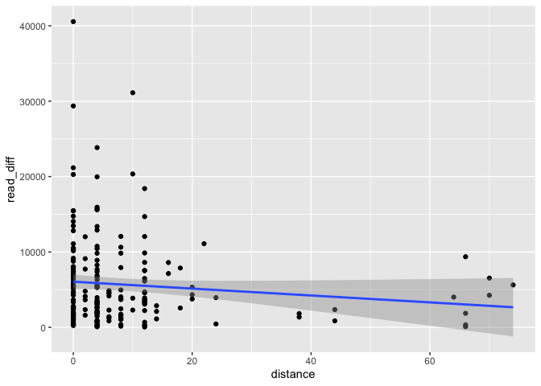
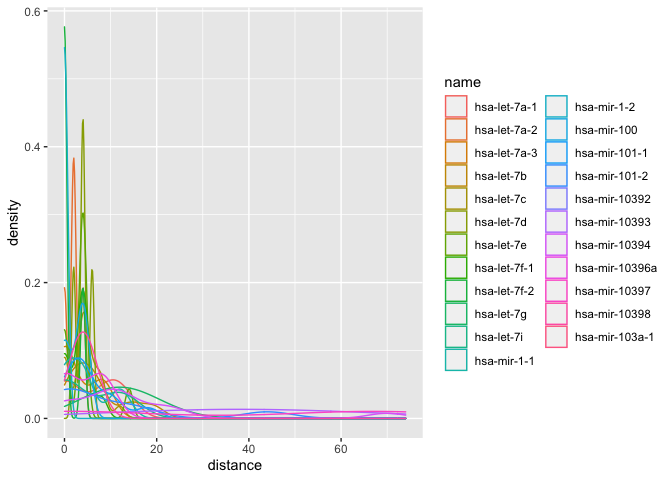
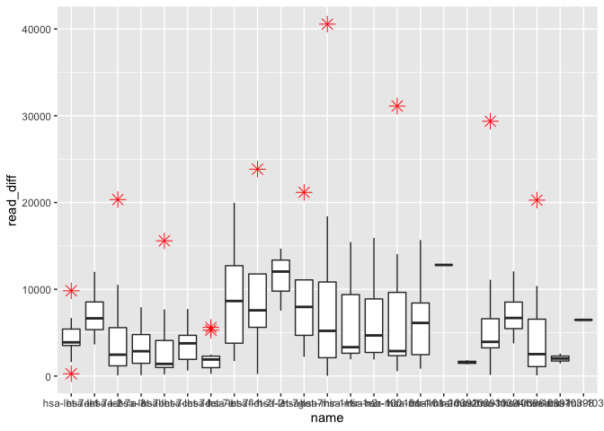
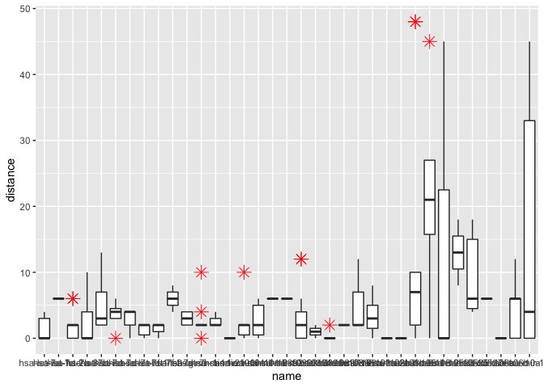

Introduction to rseAnalysis package
================
Sijie Xu
25 Nov 2020

## Introduction

`rseAnalysis` (RNA structure and Expression analysis) package includes
series of utility function including stander file reader, structural
prediction, RNA distance calculation, and analysis package.
`rseAnalysis` provides an all-in-one solution for gene expression and
secondary structure mutation correlation analysis by automating the data
processing and analysis of gene expression and mutation data from the
well-acknowledged database such as mirBase and TCGA.

To download **MPLNClust**, use the following commands:

``` r
# install.packages("devtools")
devtools::install_github("JackXu2333/rseAnalysis")
```

## Data Input

The function *vcf2df*, *fasta2df*, and *bed2df* provides measures to
read file with vcf, fasta, and bed extensions. The output file
structures is as followed:

`fasta object` 

`bed object` 

`vcf object` 

``` r

#Source library
library(rseAnalysis)

#Load sample data file
vcf <- rseAnalysis::vcf2df(system.file("extdata", "hsa_GRCh37.vcf", package = "rseAnalysis"))
#> Scanning file to determine attributes.
#> File attributes:
#>   meta lines: 13
#>   header_line: 14
#>   variant count: 15058
#>   column count: 8
#> Meta line 13 read in.
#> All meta lines processed.
#> gt matrix initialized.
#> Character matrix gt created.
#>   Character matrix gt rows: 15058
#>   Character matrix gt cols: 8
#>   skip: 0
#>   nrows: 15058
#>   row_num: 0
#> Processed variant 1000Processed variant 2000Processed variant 3000Processed variant 4000Processed variant 5000Processed variant 6000Processed variant 7000Processed variant 8000Processed variant 9000Processed variant 10000Processed variant 11000Processed variant 12000Processed variant 13000Processed variant 14000Processed variant 15000Processed variant: 15058
#> All variants processed
fasta <- rseAnalysis::fasta2df(system.file("extdata", "hsa_GRCh37.fasta", package = "rseAnalysis"))
bed <- rseAnalysis::bed2df(system.file("extdata", "hsa_GRCh37.bed", package = "rseAnalysis"))

#Inspect the imported file
head(vcf)
#>   CHROM   POS         ID REF ALT
#> 1     1 17375 MU29195949   A   G
#> 2     1 17375 MU29195949   A   G
#> 3     1 17385 MU28690335   G   A
#> 4     1 17385 MU28690335   G   A
#> 5     1 17407 MU63855538   G   A
#> 6     1 17408 MU27355001   C   G
#>                                                                                                                                                                                                                                                                                                                                                                                                                                                                                                                                                                                                                                                                                                       CONSEQUENCE
#> 1 WASH7P|ENSG00000227232|1|WASH7P-201|ENST00000423562||splice_region_variant||,WASH7P|ENSG00000227232|1|WASH7P-202|ENST00000438504||intron_variant||,DDX11L1|ENSG00000223972|+|DDX11L1-001|ENST00000450305||downstream_gene_variant||,DDX11L1|ENSG00000223972|+|DDX11L1-002|ENST00000456328||downstream_gene_variant||,WASH7P|ENSG00000227232|1|WASH7P-001|ENST00000488147||splice_region_variant||,DDX11L1|ENSG00000223972|+|DDX11L1-201|ENST00000515242||downstream_gene_variant||,DDX11L1|ENSG00000223972|+|DDX11L1-202|ENST00000518655||downstream_gene_variant||,WASH7P|ENSG00000227232|1|WASH7P-203|ENST00000538476||intron_variant||,WASH7P|ENSG00000227232|1|WASH7P-204|ENST00000541675||intron_variant||
#> 2 WASH7P|ENSG00000227232|1|WASH7P-201|ENST00000423562||splice_region_variant||,WASH7P|ENSG00000227232|1|WASH7P-202|ENST00000438504||intron_variant||,DDX11L1|ENSG00000223972|+|DDX11L1-001|ENST00000450305||downstream_gene_variant||,DDX11L1|ENSG00000223972|+|DDX11L1-002|ENST00000456328||downstream_gene_variant||,WASH7P|ENSG00000227232|1|WASH7P-001|ENST00000488147||splice_region_variant||,DDX11L1|ENSG00000223972|+|DDX11L1-201|ENST00000515242||downstream_gene_variant||,DDX11L1|ENSG00000223972|+|DDX11L1-202|ENST00000518655||downstream_gene_variant||,WASH7P|ENSG00000227232|1|WASH7P-203|ENST00000538476||intron_variant||,WASH7P|ENSG00000227232|1|WASH7P-204|ENST00000541675||intron_variant||
#> 3               WASH7P|ENSG00000227232|1|WASH7P-201|ENST00000423562||intron_variant||,WASH7P|ENSG00000227232|1|WASH7P-202|ENST00000438504||intron_variant||,DDX11L1|ENSG00000223972|+|DDX11L1-001|ENST00000450305||downstream_gene_variant||,DDX11L1|ENSG00000223972|+|DDX11L1-002|ENST00000456328||downstream_gene_variant||,WASH7P|ENSG00000227232|1|WASH7P-001|ENST00000488147||intron_variant||,DDX11L1|ENSG00000223972|+|DDX11L1-201|ENST00000515242||downstream_gene_variant||,DDX11L1|ENSG00000223972|+|DDX11L1-202|ENST00000518655||downstream_gene_variant||,WASH7P|ENSG00000227232|1|WASH7P-203|ENST00000538476||intron_variant||,WASH7P|ENSG00000227232|1|WASH7P-204|ENST00000541675||intron_variant||
#> 4               WASH7P|ENSG00000227232|1|WASH7P-201|ENST00000423562||intron_variant||,WASH7P|ENSG00000227232|1|WASH7P-202|ENST00000438504||intron_variant||,DDX11L1|ENSG00000223972|+|DDX11L1-001|ENST00000450305||downstream_gene_variant||,DDX11L1|ENSG00000223972|+|DDX11L1-002|ENST00000456328||downstream_gene_variant||,WASH7P|ENSG00000227232|1|WASH7P-001|ENST00000488147||intron_variant||,DDX11L1|ENSG00000223972|+|DDX11L1-201|ENST00000515242||downstream_gene_variant||,DDX11L1|ENSG00000223972|+|DDX11L1-202|ENST00000518655||downstream_gene_variant||,WASH7P|ENSG00000227232|1|WASH7P-203|ENST00000538476||intron_variant||,WASH7P|ENSG00000227232|1|WASH7P-204|ENST00000541675||intron_variant||
#> 5               WASH7P|ENSG00000227232|1|WASH7P-201|ENST00000423562||intron_variant||,WASH7P|ENSG00000227232|1|WASH7P-202|ENST00000438504||intron_variant||,DDX11L1|ENSG00000223972|+|DDX11L1-001|ENST00000450305||downstream_gene_variant||,DDX11L1|ENSG00000223972|+|DDX11L1-002|ENST00000456328||downstream_gene_variant||,WASH7P|ENSG00000227232|1|WASH7P-001|ENST00000488147||intron_variant||,DDX11L1|ENSG00000223972|+|DDX11L1-201|ENST00000515242||downstream_gene_variant||,DDX11L1|ENSG00000223972|+|DDX11L1-202|ENST00000518655||downstream_gene_variant||,WASH7P|ENSG00000227232|1|WASH7P-203|ENST00000538476||intron_variant||,WASH7P|ENSG00000227232|1|WASH7P-204|ENST00000541675||intron_variant||
#> 6               WASH7P|ENSG00000227232|1|WASH7P-201|ENST00000423562||intron_variant||,WASH7P|ENSG00000227232|1|WASH7P-202|ENST00000438504||intron_variant||,DDX11L1|ENSG00000223972|+|DDX11L1-001|ENST00000450305||downstream_gene_variant||,DDX11L1|ENSG00000223972|+|DDX11L1-002|ENST00000456328||downstream_gene_variant||,WASH7P|ENSG00000227232|1|WASH7P-001|ENST00000488147||intron_variant||,DDX11L1|ENSG00000223972|+|DDX11L1-201|ENST00000515242||downstream_gene_variant||,DDX11L1|ENSG00000223972|+|DDX11L1-202|ENST00000518655||downstream_gene_variant||,WASH7P|ENSG00000227232|1|WASH7P-203|ENST00000538476||intron_variant||,WASH7P|ENSG00000227232|1|WASH7P-204|ENST00000541675||intron_variant||
#>                                                          OCCURRENCE
#> 1 LAML-KR|1|205|0.00488,BRCA-EU|1|569|0.00176,PRAD-UK|2|140|0.01429
#> 2 LAML-KR|1|205|0.00488,BRCA-EU|1|569|0.00176,PRAD-UK|2|140|0.01429
#> 3                       COCA-CN|1|321|0.00312,LAML-KR|1|205|0.00488
#> 4                       COCA-CN|1|321|0.00312,LAML-KR|1|205|0.00488
#> 5                                             COCA-CN|1|321|0.00312
#> 6                                             PBCA-US|2|186|0.01075
#>   affected_donors project_count
#> 1               4             3
#> 2               4             3
#> 3               2             2
#> 4               2             2
#> 5               1             1
#> 6               2             1
head(fasta)
#>           NAME
#> 1 hsa-let-7a-1
#> 2 hsa-let-7a-2
#> 3 hsa-let-7a-3
#> 4   hsa-let-7b
#> 5   hsa-let-7c
#> 6   hsa-let-7d
#>                                                                                       SEQ
#> 1        UGGGAUGAGGUAGUAGGUUGUAUAGUUUUAGGGUCACACCCACCACUGGGAGAUAACUAUACAAUCUACUGUCUUUCCUA
#> 2                AGGUUGAGGUAGUAGGUUGUAUAGUUUAGAAUUACAUCAAGGGAGAUAACUGUACAGCCUCCUAGCUUUCCU
#> 3              GGGUGAGGUAGUAGGUUGUAUAGUUUGGGGCUCUGCCCUGCUAUGGGAUAACUAUACAAUCUACUGUCUUUCCU
#> 4     CGGGGUGAGGUAGUAGGUUGUGUGGUUUCAGGGCAGUGAUGUUGCCCCUCGGAAGAUAACUAUACAACCUACUGCCUUCCCUG
#> 5    GCAUCCGGGUUGAGGUAGUAGGUUGUAUGGUUUAGAGUUACACCCUGGGAGUUAACUGUACAACCUUCUAGCUUUCCUUGGAGC
#> 6 CCUAGGAAGAGGUAGUAGGUUGCAUAGUUUUAGGGCAGGGAUUUUGCCCACAAGGAGGUAACUAUACGACCUGCUGCCUUUCUUAGG
head(bed)
#>   CHROM STAPOS ENDPOS DIR                     TYPE           ID        ALIAS
#> 1     1  17368  17391   -                    miRNA MIMAT0027619 MIMAT0027619
#> 2     1  17368  17436   - miRNA_primary_transcript    MI0022705    MI0022705
#> 3     1  17408  17431   -                    miRNA MIMAT0027618 MIMAT0027618
#> 4     1  30365  30503   + miRNA_primary_transcript    MI0006363    MI0006363
#> 5     1  30437  30458   +                    miRNA MIMAT0005890 MIMAT0005890
#> 6     1 567994 568065   - miRNA_primary_transcript    MI0039740    MI0039740
#>              NAME
#> 1 hsa-miR-6859-3p
#> 2  hsa-mir-6859-1
#> 3 hsa-miR-6859-5p
#> 4  hsa-mir-1302-2
#> 5    hsa-miR-1302
#> 6   hsa-mir-12136
```

## Calculate RNA distance for mutated sequence

Find mutated RNA sequence based on the fasta, bed and vcf files

``` r

#Mutate RNA using mutation from vcf files
RNA.mutated <- RNA.validate(fasta = fasta, 
             vcf = vcf, 
             bed = bed)
#> The matching rate of the dataset is 0.714159236071587
```

Noted that message stated that the mutation has matching rate 0.714,
this represents that only 71.4% of the mutation reference matches the
gene sequence on sequence provided (fasta), and the remaining 28.6% of
the sequence failed to match due to misalignment, differences in genome
assemble in bed and fasta file, or potentially different representation
of wildtype among vcf file and fasta file. For tutorial purposes, we
will skip the mismatches and predict the secondary structure for the
remaining.

``` r

#Filter out the one that is misaligned, choose the first 200, or it takes forever to run
RNA.mutated <- subset(RNA.mutated, MATCH)[1:200,]

#Perform structure prediction on orginal sequence
struct.ori <- suppressMessages(predict.Structure(executable.path = "../inst/extdata/exe"
                                   , rna.name = RNA.mutated$NAME, rna.seq = RNA.mutated$SEQ))
#> Loading fasta files..

#Perform structure prediction on mutated sequence
struct.alt <- suppressMessages(predict.Structure(executable.path = "../inst/extdata/exe"
                                   , rna.name = RNA.mutated$NAME, rna.seq = RNA.mutated$MUT.SEQ))
#> Loading fasta files..
```

Calculation RNADistance based on the result from structural prediction
is straightforward, the result help determines how much of a structural
difference there are among the original and mutated RNA sequence.
Executable.path is omitted for mac or Unix user who has RNAStructure
installed see more at `?predict.distance`

``` r

#Run prediction
RNA.distance <- predict.distance(executable.path = "", name = RNA.mutated$NAME, 
                  struct.ori = struct.ori, struct.alt = struct.alt)
#> Loading files..
```

## RNA distance and gene expression analysis

``` r

#Load expression data

expression <- read.csv(system.file("extdata", "test.csv", package = "rseAnalysis"), header = TRUE)

#Use only standardize read
expression <- subset(expression, Read.Type == "reads_per_million_miRNA_mapped")[1:200, ]

Analysis.DISEXP(dis.name = RNA.mutated$NAME, dis.distance = RNA.distance, 
                exp.tumor <- expression$Sample, exp.sample <- expression$Normal, method = "linear", seperate = TRUE)
```



    #> Warning: Groups with fewer than two data points have been dropped.
    
    #> Warning: Groups with fewer than two data points have been dropped.
    #> Warning in max(ids, na.rm = TRUE): no non-missing arguments to max; returning -
    #> Inf
    
    #> Warning in max(ids, na.rm = TRUE): no non-missing arguments to max; returning -
    #> Inf



    #>          correlation   p_value
    #> distance  -0.1104666 0.1194204

Analysis.DISEXP uses the absolute difference in expression in modelling
change in expression between the tumour and normal samples from BRCA
patients. Here we use “reads\_per\_million\_miRNA\_mapped” as the input
because it is standardized and can use to compare between cases.
\!Beware that for the analysis to work, one has to make sure the gene
expression data and distance data are collected from the same type of
mutation, or from the same sample (usually a sample will be insufficient
in retrieving both expression and sequencing information), or it affects
the outcome of the analysis dramatically.

Gere the Analysis.DISEXP generate both text and graphical output, with
text output indicating the beta and p\_value of the resulting regression
model. From this example, the correlation between RNA distance is -0.11
with p-value of 0.12. The graphical output shows the prediction model
and confidence interval on the scatter plot, RNA distance distribution
by RNA type and boxplots showing the potential outliers from gene
expression and RNA distance data set.

## Package References

[Sijie Xu (NA). rseAnalysis: Correlation analysis of RNA secondary
structure mutation and differential expression. R package
version 0.1.0.](https://github.com/JackXu2333/dseAnalysis)

<br>

## Other References

Kozomara, A., & Griffiths-Jones, S. (2011). miRBase: integrating
microRNA annotation and deep-sequencing data. Nucleic acids research,
39(Database issue), D152–D157. <https://doi.org/10.1093/nar/gkq1027>

Wickham, H. and Bryan, J. (2019). *R Packages* (2nd edition). Newton,
Massachusetts: O’Reilly Media. <https://r-pkgs.org/>

TCGA Research Network: <https://www.cancer.gov/tcga>.

Zhiwen. T, Sijie Xu (2020) miRNA Motif Analysis
<https://github.com/Deemolotus/BCB330Y-and-BCB430Y/tree/master/Main>

\#\[END\]

-----

``` r
sessionInfo()
#> R version 4.0.2 (2020-06-22)
#> Platform: x86_64-apple-darwin17.0 (64-bit)
#> Running under: macOS Catalina 10.15.7
#> 
#> Matrix products: default
#> BLAS:   /Library/Frameworks/R.framework/Versions/4.0/Resources/lib/libRblas.dylib
#> LAPACK: /Library/Frameworks/R.framework/Versions/4.0/Resources/lib/libRlapack.dylib
#> 
#> locale:
#> [1] C/en_CA.UTF-8/en_CA.UTF-8/C/en_CA.UTF-8/en_CA.UTF-8
#> 
#> attached base packages:
#> [1] stats     graphics  grDevices utils     datasets  methods   base     
#> 
#> other attached packages:
#> [1] rseAnalysis_0.1.0
#> 
#> loaded via a namespace (and not attached):
#>   [1] colorspace_1.4-1            seqinr_4.2-4               
#>   [3] ellipsis_0.3.1              rprojroot_1.3-2            
#>   [5] XVector_0.28.0              GenomicRanges_1.40.0       
#>   [7] fs_1.5.0                    rstudioapi_0.11            
#>   [9] farver_2.0.3                roxygen2_7.1.1             
#>  [11] remotes_2.2.0               bit64_4.0.5                
#>  [13] AnnotationDbi_1.50.3        fansi_0.4.1                
#>  [15] xml2_1.3.2                  splines_4.0.2              
#>  [17] R.methodsS3_1.8.1           memuse_4.1-0               
#>  [19] geneplotter_1.66.0          knitr_1.30                 
#>  [21] pkgload_1.1.0               ade4_1.7-15                
#>  [23] annotate_1.66.0             cluster_2.1.0              
#>  [25] R.oo_1.24.0                 compiler_4.0.2             
#>  [27] backports_1.1.10            assertthat_0.2.1           
#>  [29] Matrix_1.2-18               cli_2.1.0                  
#>  [31] htmltools_0.5.0             prettyunits_1.1.1          
#>  [33] tools_4.0.2                 gtable_0.3.0               
#>  [35] glue_1.4.2                  GenomeInfoDbData_1.2.3     
#>  [37] dplyr_1.0.2                 Rcpp_1.0.5                 
#>  [39] Biobase_2.48.0              vctrs_0.3.4                
#>  [41] Biostrings_2.56.0           ape_5.4-1                  
#>  [43] nlme_3.1-149                pinfsc50_1.2.0             
#>  [45] xfun_0.18                   stringr_1.4.0              
#>  [47] ps_1.4.0                    testthat_2.3.2             
#>  [49] lifecycle_0.2.0             devtools_2.3.2             
#>  [51] XML_3.99-0.5                zlibbioc_1.34.0            
#>  [53] MASS_7.3-53                 scales_1.1.1               
#>  [55] parallel_4.0.2              SummarizedExperiment_1.18.2
#>  [57] RColorBrewer_1.1-2          yaml_2.2.1                 
#>  [59] memoise_1.1.0               gridExtra_2.3              
#>  [61] ggplot2_3.3.2               reshape_0.8.8              
#>  [63] stringi_1.5.3               RSQLite_2.2.1              
#>  [65] genefilter_1.70.0           S4Vectors_0.26.1           
#>  [67] desc_1.2.0                  permute_0.9-5              
#>  [69] BiocGenerics_0.34.0         pkgbuild_1.1.0             
#>  [71] BiocParallel_1.22.0         GenomeInfoDb_1.24.2        
#>  [73] rlang_0.4.8                 pkgconfig_2.0.3            
#>  [75] matrixStats_0.57.0          bitops_1.0-6               
#>  [77] evaluate_0.14               lattice_0.20-41            
#>  [79] purrr_0.3.4                 labeling_0.3               
#>  [81] bit_4.0.4                   processx_3.4.4             
#>  [83] tidyselect_1.1.0            plyr_1.8.6                 
#>  [85] magrittr_1.5                DESeq2_1.28.1              
#>  [87] R6_2.4.1                    IRanges_2.22.2             
#>  [89] generics_0.0.2              DelayedArray_0.14.1        
#>  [91] DBI_1.1.0                   pillar_1.4.6               
#>  [93] withr_2.3.0                 mgcv_1.8-33                
#>  [95] survival_3.2-7              RCurl_1.98-1.2             
#>  [97] tibble_3.0.4                crayon_1.3.4               
#>  [99] R.rsp_0.44.0                rmarkdown_2.4              
#> [101] vcfR_1.12.0                 usethis_1.6.3              
#> [103] locfit_1.5-9.4              grid_4.0.2                 
#> [105] blob_1.2.1                  callr_3.5.1                
#> [107] vegan_2.5-6                 digest_0.6.25              
#> [109] xtable_1.8-4                R.cache_0.14.0             
#> [111] tidyr_1.1.2                 R.utils_2.10.1             
#> [113] stats4_4.0.2                munsell_0.5.0              
#> [115] viridisLite_0.3.0           sessioninfo_1.1.1
```
